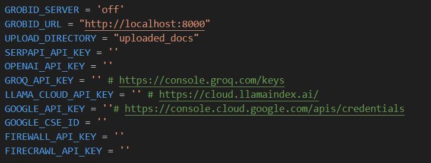

# Developing a Tuberculosis Q&A Database Using Q&A-ET: Question and Answer Evaluator Toolkit

This repository is designed to process segments of documents, leveraging large language models (LLMs) to generate questions based on the content autonomously. It also provides a feature that allows users to evaluate and rate the quality of the generated questions, ensuring continuous improvement in the relevance and accuracy of the interactions


## .env
Fill out your decencies keys in the .env file



Note: if you are a Windows user, you run it on WSL.

## Dependencies
 - docker pull grobid/grobid:0.8.0
 - Ollama: https://ollama.com/download
 - pip install -r requirements.txt
 - pip install -r grobid_requirements.txt (run it on wsl if you are on windows)

## RUN Grobid
 - docker run --rm --init --ulimit core=0 -p 8070:8070 grobid/grobid:0.8.0
 - python app.py (run this command only if you adjusted GROBID_SERVER to on)

## Add Keys to environmental variable
Add environmental variables in the .env file

## Run The Solution
To run the solution execute the following command in a terminal:  
`streamlit run main.py` 

## Files to consider checking

`shared/shared_variables.py` for ai models to use  
`shared/services/model_handler_service.py` how ai models are handled  
`database_service.py` how vector database is managed

## 🖊️ Citation

Please kindly cite our paper if you use our code, data or results:
```bibtex
@inproceedings{1cc57b91-c70f-46ca-a65a-094cdd4cf77a,
title = {Developing a Tuberculosis Q\&A Database Using Q\&A-ET: Question and Answer Evaluator Toolkit},
author = {Al Akl, Jihad and Abou Jaoude, Chady and Chami, Zahi and Guyeux, Christophe and Laiymani, David and Sola, Christophe},
year = {2025},
address = {Byblos, Lebanon},
booktitle = {5th IEEE Middle East and North Africa COMMunications Conference (MENACOMM 2025)},
editor = {},
month = {feb}
}
```

