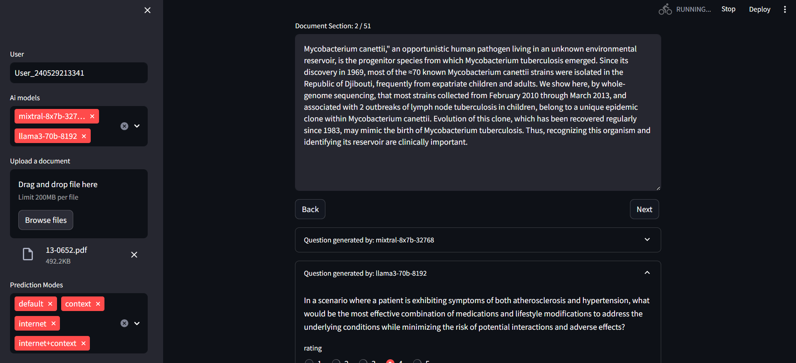

# Question-Generator-Evaluator-Tool

This repository is designed to process segments of documents, leveraging large language models (LLMs) to autonomously generate questions based on the content. It also provides a feature that allows users to evaluate and rate the quality of the generated questions, ensuring a continuous improvement in the relevance and accuracy of the interactions

## Dependencies
 - Ollama: https://ollama.com/download
 - pip install -r requirements.txt

## Add Keys to environmental variable
Add openAi key (OPENAI_API_KEY) in the terminal before running the solution.

## Run The Solution
To run the solution execute the following command in a terminal
`streamlit run main.py`

